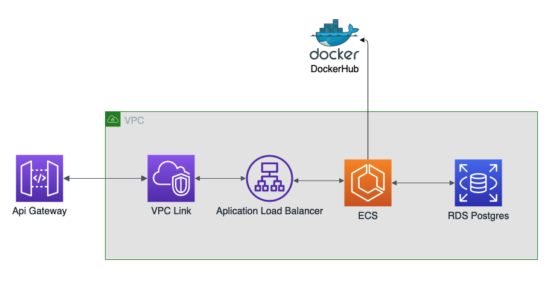

## PosTech Software Architecture

Projeto do tech challenge para avaliação do módulo 3 do curso Software Architecture.

### Diagrama de infraestrutura aws

O diagrama abaixo descreve os serviços que serão provisionados via terraform.

Serviços que serão criados pelo terraform:
- VPC 
- Security Group
- Application Load Balancer
- RDS - Postgresql

